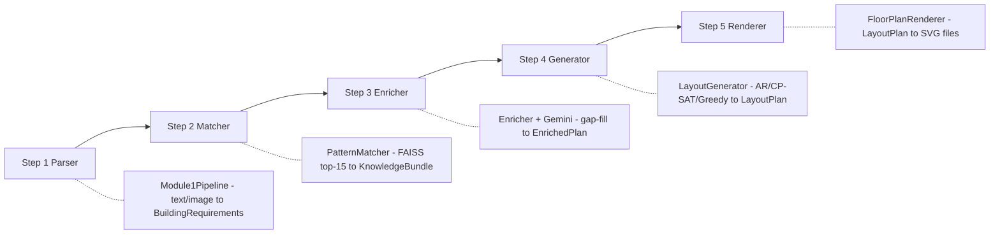

# PlanGen Backend Review — Pre-Frontend Audit

> Reviewed: 2026-07-02 | Weights: epoch-50 checkpoint | All imports: passing

---

## 1. Weights Folder Audit

### Current contents of `modules/step4_generate/weights/`

| File | Size | Status | Notes |
|------|------|--------|-------|
| `ar_checkpoint_latest.pt` | 587.6 MB | **Current** | Epoch 50, best_val_loss = **-33.17** |
| `ar_transformer.npz` | 179.8 MB | **Just re-exported** | Matches epoch-50 checkpoint (237 arrays) |
| `gnn_encoder.npz` | 1.6 MB | **Just re-exported** | Matches epoch-50 checkpoint |
| `ar_training_history.json` | 1.3 KB | **Current** | 46 train + 46 val entries |
| `training_history.json` | 91 B | **Old placeholder** | 1-epoch placeholder from before training |
| `cache/` (2 .pkl files) | ~210 MB | OK | Training data cache (needed for future training) |

### Root-level files to clean up

| File | Size | Recommendation |
|------|------|----------------|
| `ar_checkpoint_latest (1).pt` | 587.5 MB | **Delete** — old Jun 28 copy, superseded by epoch-50 in weights/ |
| `ar_training_history (1).json` | 0.4 KB | **Delete** — old 13-epoch history, superseded |

> [!TIP]
> Deleting these two root-level files frees **~588 MB**. The authoritative copies are in `weights/`.

### Also recommend removing

| File | Reason |
|------|--------|
| `weights/training_history.json` | Old 1-epoch placeholder from initial GNN training. The real history is `ar_training_history.json` |

---

## 2. Training Progress

```
Epochs trained:  50 (46 logged in history - 4 from an earlier account)
Best val loss:   -33.17 (epoch 44)
Loss trend:      -5.07 -> -29.41 (train), -10.20 -> -33.02 (val)
```

The negative loss is expected — this is negative log-likelihood from the Mixture of Gaussians head. Lower = better. **The model is still converging** (no plateau yet), so more training will improve output quality. For now, 50 epochs is a solid baseline to start with the frontend.

> [!NOTE]
> The val loss is **better** than train loss (val: -33.0 vs train: -29.4), which is unusual. This likely means the validation set is smaller and easier (fewer rooms per plan on average). Not a concern for deployment.

---

## 3. Pipeline Architecture



| Step | Module | Key Files | Status |
|------|--------|-----------|--------|
| 1 - Parse | `step1_parse/` | [parser.py](file:///c:/Users/Welcome/Desktop/PlanGen/modules/step1_parse/parser.py), [interactive_gatherer.py](file:///c:/Users/Welcome/Desktop/PlanGen/modules/step1_parse/interactive_gatherer.py), [image_analyzer.py](file:///c:/Users/Welcome/Desktop/PlanGen/modules/step1_parse/image_analyzer.py) | Production-ready |
| 2 - Match | `step2_match/` | [matcher.py](file:///c:/Users/Welcome/Desktop/PlanGen/modules/step2_match/matcher.py), [semantic_matcher.py](file:///c:/Users/Welcome/Desktop/PlanGen/modules/step2_match/semantic_matcher.py), [feature_encoder.py](file:///c:/Users/Welcome/Desktop/PlanGen/modules/step2_match/feature_encoder.py) | Production-ready |
| 3 - Enrich | `step3_enrich/` | [enricher.py](file:///c:/Users/Welcome/Desktop/PlanGen/modules/step3_enrich/enricher.py), [room_resolver.py](file:///c:/Users/Welcome/Desktop/PlanGen/modules/step3_enrich/room_resolver.py), [vastu_mapper.py](file:///c:/Users/Welcome/Desktop/PlanGen/modules/step3_enrich/vastu_mapper.py) | Production-ready |
| 4 - Generate | `step4_generate/` | [generator.py](file:///c:/Users/Welcome/Desktop/PlanGen/modules/step4_generate/generator.py), [autoregressive_engine.py](file:///c:/Users/Welcome/Desktop/PlanGen/modules/step4_generate/autoregressive_engine.py), [autoregressive_transformer.py](file:///c:/Users/Welcome/Desktop/PlanGen/modules/step4_generate/autoregressive_transformer.py), [solver.py](file:///c:/Users/Welcome/Desktop/PlanGen/modules/step4_generate/solver.py), [greedy_placer.py](file:///c:/Users/Welcome/Desktop/PlanGen/modules/step4_generate/greedy_placer.py) | Production-ready |
| 5 - Render | `step4_generate/` | [renderer.py](file:///c:/Users/Welcome/Desktop/PlanGen/modules/step4_generate/renderer.py) (1095 lines) | Production-ready |
| Data | `data_prep/` | [nbc_schema.py](file:///c:/Users/Welcome/Desktop/PlanGen/modules/data_prep/nbc_schema.py) (38KB) | Complete NBC dataset |
| Models | root | [models.py](file:///c:/Users/Welcome/Desktop/PlanGen/models.py) (655 lines, 17 Pydantic models) | Production-ready |
| Pipeline | root | [main.py](file:///c:/Users/Welcome/Desktop/PlanGen/main.py) (360 lines) | End-to-end working |

---

## 4. Code Health

### What's Working Well

- **Strong typing**: 17 Pydantic models with validators, field descriptions, and summary methods
- **Multi-solver cascade**: AR Transformer -> CP-SAT -> Greedy — always produces output
- **Quality gate**: AR output below 0.25 quality auto-falls back to CP-SAT
- **Post-placement validation**: `_clamp_rooms()` enforces max-area + aspect-ratio + min-buildable warnings
- **Professional renderer**: 1095-line SVG renderer with doors, windows, compass rose, scale bar, title block
- **Interactive Q&A**: Multi-turn conversational parser with tier-based field gathering
- **Image analysis**: Multimodal input (sketch/photo to BuildingRequirements) via Gemini
- **NBC compliance**: Comprehensive Indian building standards (setbacks, min dimensions, FAR, ceiling heights)
- **Vastu mapping**: Full directional preferences for all room types
- **FAISS matching**: Top-15 similar plans from CubiCasa5K for statistical room sizing

### Minor Issues (Non-Blocking)

| Issue | Severity | Location |
|-------|----------|----------|
| Old `diffusion_engine.py` + `diffusion_decoder.py` still in `step4_generate/` | Low | Legacy files, ~72KB — can be removed |
| `training_history.json` in weights/ is a 1-epoch placeholder | Low | Confusing but harmless |
| No `__init__.py` in training/ subdirectory | Low | Not needed for current imports |
| `.gitignore` doesn't exclude `*.pt`, `*.npz`, `output/` | Medium | Large binaries may accidentally get committed |

### Frontend-Blocking Issue

**No REST API exists yet.** The backend is CLI-only (`main.py`). The frontend spec at [API_CONTRACT.md](file:///c:/Users/Welcome/Desktop/PlanGen/frontend_dummy/spec/API_CONTRACT.md) defines a FastAPI wrapper, but it hasn't been built. The frontend needs these endpoints:

| Priority | Endpoint | Backend Function |
|----------|----------|-----------------|
| P0 | `POST /api/v1/sessions` | Create session |
| P0 | `POST /api/v1/parse/text` | `Module1Pipeline.execute()` |
| P0 | `POST /api/v1/parse/answer` | `Module1Pipeline.process_interactive_answer()` |
| P0 | `POST /api/v1/pipeline/run` | `run_pipeline()` from main.py |
| P0 | `GET /api/v1/runs/{id}/svg/{floor}` | Serve rendered SVGs |
| P1 | `POST /api/v1/parse/image` | `Module1Pipeline.execute_with_image()` |
| P1 | `WS /api/v1/pipeline/run/stream` | Stream progress events |
| P2 | `GET /api/v1/health` | Engine/matcher status |

---

## 5. Frontend Readiness Checklist

| # | Requirement | Status |
|---|------------|--------|
| 1 | All 5 pipeline steps execute end-to-end | Done |
| 2 | AR model trained and weights exported (.npz) | Done - Epoch 50, re-exported today |
| 3 | Quality gate prevents garbage output | Done - Gate at 0.25, falls back to CP-SAT |
| 4 | SVG renderer produces professional floor plans | Done - 1095-line renderer |
| 5 | Pydantic models define all data contracts | Done - 17 models in models.py |
| 6 | API contract documented | Done - API_CONTRACT.md |
| 7 | Frontend design system documented | Done - DESIGN_SYSTEM.md |
| 8 | TypeScript data models defined | Done - DATA_MODELS.ts |
| 9 | Feature matrix defined | Done - FEATURE_MATRIX.md |
| 10 | **FastAPI REST wrapper built** | **Not yet** |
| 11 | Root-level junk files cleaned up | **Not yet** - ~588 MB to reclaim |

---

## 6. Recommended Next Steps

### Before Frontend Development

1. **Clean up old files** — delete root-level `ar_checkpoint_latest (1).pt`, `ar_training_history (1).json`, and `weights/training_history.json`
2. **Update `.gitignore`** — add `*.pt`, `*.npz`, `*.pkl`, `output/`, `frontend_dummy/`
3. **Build the FastAPI wrapper** — thin REST API around existing pipeline functions per API_CONTRACT.md

### Frontend Development Options

The [STITCH_PROMPT.md](file:///c:/Users/Welcome/Desktop/PlanGen/frontend_dummy/STITCH_PROMPT.md) already defines:
- Two UI modes: **Simple** (wizard) and **Grand** (architectural studio)
- Monochrome design system with blueprint aesthetic
- Vite + React + TypeScript tech stack
- Full component breakdown with 5 spec files

> [!IMPORTANT]
> **Decision needed:** Do you want to:
> - **(A)** Build the FastAPI API wrapper first, then the frontend?
> - **(B)** Build the frontend first with mock data, then wire up the API?
> - **(C)** Build both simultaneously?
